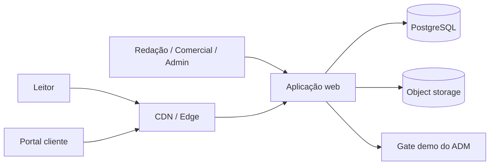

# Arquitetura técnica

## Decisão confirmada para o MVP-0

Construir um monólito modular em TypeScript com Next.js, publicado na Vercel e conectado ao Supabase. Aplicação pública, ADM e rotas server-side ficam no mesmo repositório.

Isso reduz custo operacional e acelera o MVP sem impedir extrações futuras.

## Stack de referência

As versões devem ser fixadas no início da implementação, após validação de compatibilidade.

| Camada | Sugestão | Motivo |
|---|---|---|
| Front-end e BFF | Next.js + React + TypeScript | SSR/ISR, SEO, rotas públicas e admin no mesmo ecossistema |
| UI | CSS variables + Tailwind ou CSS Modules + biblioteca headless | Tokens white-label e componentes acessíveis |
| Hospedagem | Vercel | Deploy pelo Git e previews por branch |
| Banco | Supabase Postgres | PostgreSQL gerenciado e integração rápida |
| Acesso a dados | Supabase JS server-side + SQL migrations | Menos camadas no MVP-0 |
| Editor rico | Tiptap/ProseMirror | Documento estruturado e extensível |
| Storage | Supabase Storage | Imagens e logos de demonstração |
| Cache/rate limit | Nenhum serviço dedicado no MVP-0 | Evitar infraestrutura prematura |
| Filas | Nenhuma fila dedicada no MVP-0 | Agendamento completo fica para depois |
| Gate ADM | Credencial demo em env + cookie assinado | Tela de login sem autenticação real |
| Observabilidade | logs estruturados + erros + métricas | Diagnóstico de publicação e consumo |
| Testes | unitários, integração e E2E | Regras de tenant, workflow e fluxos críticos |

O domínio deve continuar separado das chamadas ao Supabase, mas não criar adapters genéricos sem uso real.

### Regra de acesso ao Supabase

- usar cliente server-side;
- nunca expor secret/service role ao browser;
- habilitar RLS em todas as tabelas do schema exposto;
- não conceder escrita direta a `anon`;
- páginas públicas e ADM acessam dados por Server Components, Server Actions ou Route Handlers;
- Supabase Auth não faz parte do MVP-0;
- se o servidor usar service role, o escopo de tenant continua obrigatório porque essa chave ignora RLS.

### Gate demonstrativo do ADM

- `DEMO_ADMIN_USER=USER`;
- `DEMO_ADMIN_PASSWORD=User123`;
- `DEMO_SESSION_SECRET` aleatório no ambiente;
- validação server-side;
- cookie assinado com expiração curta;
- guard server-side para `/admin`;
- logout invalida o cookie;
- aviso de modo demo em todas as páginas do ADM.

Esse mecanismo não é autenticação de produção.

## Visão de contêineres



## Módulos de domínio

### Identity & Access - pós-MVP-0

- usuários;
- memberships por tenant;
- papéis e capacidades;
- sessão;
- convites;
- recuperação;
- impersonação apenas se aprovada, sempre auditada.

No MVP-0, este módulo é substituído pelo gate demonstrativo.

### Tenancy

- clientes/tenants;
- domínios;
- estado comercial;
- limites;
- resolução de tenant por host ou preview;
- isolamento e políticas.

### Editorial

- matérias e revisões;
- autores, fontes, taxonomia e mídia;
- workflow;
- preview;
- correções;
- agenda.

### Distribution - versão demonstrativa

- licenciamento por tenant;
- janela;
- overrides de chamada;
- rota JSON demo;
- sem credenciais comerciais;
- webhooks futuros;
- tombstones de remoção.

### Presentation

- temas;
- tokens;
- assets;
- variantes;
- navegação;
- templates;
- placements/destaques;
- publicação e rollback de tema.

### Audit & Analytics

- trilha de mudanças;
- eventos de produto;
- consumo de API;
- logs técnicos;
- métricas editoriais e comerciais.

## Organização sugerida do repositório

```text
apps/
  web/                  # portal, admin e APIs HTTP
packages/
  domain/               # regras puras e casos de uso
  db/                   # schema, migrations e repositories
  ui/                   # componentes e contrato de tokens
  demo-access/          # gate temporário do ADM
  content/              # editor, validação e renderização
  observability/        # logs, métricas e tracing
  config/               # ambiente e feature flags
docs/
  adr/                  # decisões arquiteturais aceitas
```

Uma única aplicação também é aceitável no início, desde que as fronteiras acima existam no código.

## Resolução de tenant

Ordem sugerida:

1. link de preview assinado;
2. domínio customizado verificado;
3. subdomínio da plataforma;
4. tenant editorial principal;
5. erro seguro, nunca fallback silencioso para outro cliente.

O tenant resolvido deve formar um `RequestContext` imutável:

```ts
type RequestContext = {
  requestId: string;
  tenantId: string;
  actorId?: string;
  capabilities: string[];
  mode: "public" | "preview" | "admin" | "api";
};
```

Repositories e casos de uso recebem o contexto ou `tenantId` explicitamente. Evitar funções globais que possam consultar registros sem escopo.

## Estratégia multi-tenant

MVP: banco e schema compartilhados, com `tenant_id` nas entidades privadas e índices compostos.

Defesas:

- autorização na camada de casos de uso;
- filtros obrigatórios nos repositories;
- testes de vazamento entre tenants;
- constraints e índices compostos;
- Row Level Security no PostgreSQL como defesa adicional, se compatível com o ORM escolhido;
- chaves e segredos nunca expostos em responses administrativas.

Não criar um banco por demo. Essa abordagem inviabiliza o principal benefício comercial.

## Renderização do portal

### Páginas públicas

- renderização no servidor;
- cache por `tenant + path + themeVersion + contentVersion`;
- invalidação orientada a eventos ao publicar/pausar;
- `noindex, nofollow` e ausência de sitemap enquanto o conteúdo for fictício;
- aviso visível de ambiente demonstrativo;
- metadados gerados pelo tenant e conteúdo quando o projeto sair do modo demo;
- imagens responsivas e otimizadas.

### Preview

- `noindex, nofollow`;
- sem cache público compartilhado;
- banner obrigatório de demonstração;
- token opaco, hash armazenado;
- validade e revogação;
- bloqueio de acesso a admin/API.

### Administração

- sem indexação;
- dados dinâmicos;
- checagem de capacidade no servidor;
- proteção contra CSRF conforme estratégia de sessão;
- autosave com controle de versão.

## Busca

MVP:

- PostgreSQL Full Text Search;
- normalização de acentos;
- pesos diferentes para título, linha fina, corpo e tags;
- filtro obrigatório por conteúdo publicado e distribuído ao tenant;
- ordenação por relevância e recência.

Migrar para mecanismo dedicado apenas se volume, latência ou recursos justificarem.

## Tarefas assíncronas - pós-MVP-0

- publicação e despublicação agendadas;
- início/fim de distribuição;
- geração de derivados de imagem;
- envio de webhooks;
- invalidação de cache;
- expiração de preview;
- agregação de métricas;
- verificação de links/fontes futura.

Requisitos:

- jobs idempotentes;
- retries com backoff;
- dead-letter/estado de falha;
- correlação com `requestId`;
- painel mínimo de diagnóstico.

## Mídia

Fluxo:

1. solicitar URL de upload assinada;
2. validar tipo e tamanho;
3. armazenar original;
4. escanear/validar;
5. gerar derivados;
6. registrar dimensões, hash, crédito, direito e texto alternativo;
7. servir por CDN.

Logos e fontes pertencem ao tenant. Imagens editoriais podem ser do catálogo global ou privadas.

## Ambientes

- `local`: dados seed e storage local/compatível;
- `staging`: integrações de teste, domínios próprios e conteúdo fictício;
- `production-demo`: somente dados fictícios, segredos isolados e backups;
- não inserir conteúdo real ou sensível até substituir o gate demonstrativo.

## Estratégia de deploy

- repositório GitHub conectado à Vercel;
- `main` como produção;
- branches e pull requests como previews;
- variáveis separadas por ambiente na Vercel;
- Supabase de desenvolvimento separado de produção quando o piloto começar;
- migrations backward-compatible;
- deploy da aplicação antes de remover campos;
- health checks;
- rollback de aplicação;
- backup e teste de restauração;
- feature flags para funções incompletas;
- domínio e certificado automatizados quando possível.

## SLOs iniciais - produto real

| Indicador | Meta |
|---|---:|
| Disponibilidade portal/feed | 99,5% mensal |
| p95 página pública em cache | < 800 ms no servidor |
| p95 API de listagem | < 500 ms, sem contar rede do cliente |
| Propagação de pausa | < 60 s |
| Publicação agendada | até 60 s do horário definido |
| RPO | 24 h no piloto, revisar para produção |
| RTO | 4 h no piloto, revisar contratualmente |

## Testes prioritários

1. isolamento de tenant;
2. permissão por capacidade;
3. transições editoriais;
4. janela de distribuição;
5. publicação/rollback de tema;
6. expiração e revogação de preview;
7. rotação de API key;
8. consulta incremental e tombstone;
9. SEO/canonical por tenant;
10. responsividade das páginas públicas.

## Dívidas proibidas

- `tenant_id` opcional em dado privado sem justificativa;
- tema armazenado como CSS livre;
- HTML editorial não sanitizado;
- exclusão física de matéria publicada como fluxo comum;
- credencial em texto puro;
- permissão verificada apenas no cliente;
- cron sem idempotência;
- duplicação de matéria por cliente;
- lógica de status espalhada em componentes.
