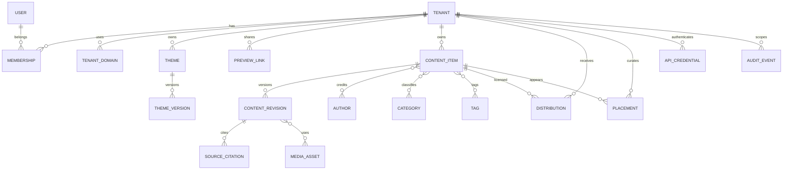
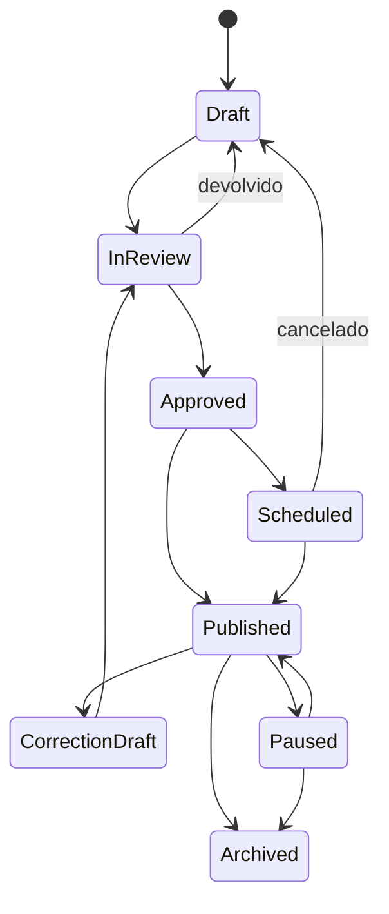

# Modelo de dados

## Implementação do MVP-0

O diagrama completo abaixo descreve a evolução do produto. Para o MVP-0, implementar apenas:

- `tenants`;
- `content_items`;
- `content_revisions` simplificada;
- `authors`, `categories` e `tags`;
- tabelas de vínculo do conteúdo;
- `media_assets`;
- `distributions`;
- `placements`;
- `themes` e `theme_versions`;
- `audit_events`.

Não implementar agora `users`, `memberships`, `api_credentials`, `api_usage_rollups` ou integração com `auth.users`.

Todas as tabelas do MVP-0:

- têm RLS habilitado;
- não aceitam escrita direta do browser;
- são acessadas pelo servidor Next.js;
- recebem dados fictícios com `is_demo = true` onde aplicável.

## Princípio

Separar quatro conceitos:

1. identidade do conteúdo;
2. versão editorial aprovada;
3. direito/distribuição por tenant;
4. apresentação e destaque por tenant.

Essa separação permite corrigir uma matéria uma vez e refletir a atualização nos canais autorizados, preservando overrides comerciais.

## Visão relacional

## Entidades

### Tenant

Representa operação editorial, cliente, prospect ou sandbox.

Campos essenciais:

- `id`;
- `slug`;
- `display_name`;
- `legal_name` opcional;
- `kind`: `platform`, `client`, `demo`, `sandbox`;
- `status`: `demo`, `trial`, `active`, `suspended`, `archived`;
- `default_locale`;
- `timezone`;
- `settings_json`;
- `created_at`, `updated_at`, `archived_at`.

Invariantes:

- `slug` globalmente único;
- tenant suspenso não publica nem distribui;
- tenant arquivado mantém histórico.

### TenantDomain

- `tenant_id`;
- `hostname`;
- `kind`: `platform_subdomain`, `custom`, `preview`;
- `status`: `pending`, `verified`, `active`, `failed`;
- `verification_token_hash`;
- `is_primary`;
- timestamps.

Um hostname ativo pertence a um único tenant.

### User

Pós-MVP-0.

- identidade global;
- nome e e-mail normalizado;
- estado;
- dados do provedor de autenticação;
- último acesso;
- preferências não sensíveis.

### Membership

Pós-MVP-0.

Liga usuário e tenant.

- `tenant_id`;
- `user_id`;
- `role`;
- capacidades adicionais opcionais;
- status;
- convite;
- timestamps.

Constraint única: `tenant_id + user_id`.

### ContentItem

Identidade estável da matéria.

- `id`;
- `owner_tenant_id`;
- `canonical_slug`;
- `content_type`;
- `workflow_status`;
- `visibility`: `catalog`, `private`, `platform_only`;
- `current_published_revision_id` opcional;
- `first_published_at`;
- `last_published_at`;
- `paused_at`, `archived_at`;
- `embargo_until`;
- `created_by`, `updated_by`;
- timestamps.

O item não guarda o corpo mutável.

### ContentRevision

Snapshot imutável após aprovação/publicação.

- `id`;
- `content_item_id`;
- `revision_number`;
- `title`;
- `subtitle`;
- `slug_snapshot`;
- `body_json`;
- `body_text`;
- `seo_title`, `seo_description`;
- `correction_note`;
- `sponsorship_label`;
- `medical_review_status`;
- `word_count`;
- `created_by`;
- `approved_by`, `approved_at`;
- `change_summary`;
- timestamps.

Relacionamentos de autoria, fontes, mídia e taxonomia devem ser versionados ou copiados em tabelas de vínculo com a revisão quando uma alteração histórica importar.

### Author

- nome público;
- slug;
- bio;
- foto;
- e-mail interno opcional;
- credenciais e áreas de especialidade;
- redes aprovadas;
- estado.

### Category e Tag

Taxonomia configurável. Categorias formam navegação; tags descrevem temas transversais.

Campos:

- `owner_tenant_id` opcional para taxonomia privada;
- nome;
- slug;
- parent opcional;
- estado;
- metadados SEO.

### SourceCitation

Fonte jornalística estruturada.

- `content_revision_id`;
- `source_type`: estudo, órgão público, entrevista, empresa, base de dados, comunicado, outra;
- `title`;
- `publisher`;
- `url`;
- `published_at`;
- `accessed_at`;
- `doi`/identificador opcional;
- `is_primary`;
- `notes_internal`;
- ordem.

Não substituir apuração por uma lista de links; a entidade serve para procedência e revisão.

### MediaAsset

- `owner_tenant_id` opcional;
- `storage_key`;
- `mime_type`;
- `size_bytes`;
- dimensões;
- hash;
- `alt_text`;
- `caption`;
- `credit`;
- `rights_basis`;
- `license_expires_at`;
- status de processamento;
- metadados de derivados.

### Distribution

Autoriza um tenant a receber um item.

- `content_item_id`;
- `tenant_id`;
- `status`: `draft`, `scheduled`, `active`, `paused`, `expired`, `revoked`;
- `starts_at`, `ends_at`;
- `channels`: portal, api, rss;
- `headline_override`;
- `subtitle_override`;
- `slug_override`;
- `category_override_id`;
- `rights_code`;
- `contract_reference`;
- `allow_full_body`;
- `allow_media`;
- `created_by`, `approved_by`;
- timestamps.

Constraint preferida: uma distribuição ativa por `content_item_id + tenant_id`, salvo exigência explícita de múltiplas janelas.

### Placement

Curadoria visual por tenant, independente da distribuição.

- `tenant_id`;
- `slot_key`;
- `content_item_id`;
- `starts_at`, `ends_at`;
- `rank`;
- `presentation_variant`;
- `eyebrow_override`;
- `image_override_id`;
- estado.

Exemplos de `slot_key`: `home.hero`, `home.secondary`, `category.health.featured`.

### Theme

- `tenant_id`;
- nome;
- estado;
- `published_version_id`;
- `draft_version_id`;
- timestamps.

### ThemeVersion

Snapshot imutável após publicação.

- `theme_id`;
- `version_number`;
- `schema_version`;
- `tokens_json`;
- `components_json`;
- `navigation_json`;
- `brand_json`;
- `created_by`;
- `published_by`, `published_at`;
- `change_summary`.

### PreviewLink

- `tenant_id`;
- `theme_version_id` opcional;
- `token_hash`;
- `expires_at`;
- `revoked_at`;
- `password_hash` opcional;
- `allowed_paths` opcional;
- `created_by`;
- contadores de acesso não identificáveis.

O token bruto é exibido uma vez e nunca armazenado.

### ApiCredential

- `tenant_id`;
- `name`;
- `prefix`;
- `secret_hash`;
- `scopes`;
- `rate_limit_plan`;
- `last_used_at`;
- `expires_at`;
- `revoked_at`;
- `created_by`.

### AuditEvent

Append-only:

- `id`;
- `tenant_id`;
- `actor_id`;
- `action`;
- `target_type`, `target_id`;
- `request_id`;
- `ip_hash` ou endereço conforme política;
- `user_agent_summary`;
- `before_json` redigido;
- `after_json` redigido;
- `reason`;
- `created_at`.

Nunca registrar segredo, corpo de senha ou token bruto.

### ApiUsageRollup

Agregado, não log detalhado eterno:

- `tenant_id`;
- `credential_id`;
- período;
- endpoint;
- status class;
- quantidade;
- latência agregada;
- bytes aproximados.

## Estados editoriais

`workflow_status` deve ser alterado por casos de uso explícitos. Não permitir update genérico.

## Slugs e URLs

- identificador interno nunca muda;
- slug canônico pode gerar redirect ao mudar;
- override de slug por tenant é permitido;
- unicidade por `tenant + locale + path`;
- API usa UUID/ULID estável, não slug;
- canonical SEO aponta para a URL licenciada definida pela estratégia comercial.

## Exclusão

- drafts nunca publicados podem ser excluídos por política;
- conteúdo publicado usa arquivamento/tombstone;
- tenants e usuários usam desativação;
- eventos de auditoria são retidos conforme política;
- pedidos LGPD devem distinguir dado pessoal de registro jornalístico e obrigação legal.

## Índices mínimos

- `tenant_domain(hostname, status)`;
- `membership(tenant_id, user_id, status)`;
- `content_item(owner_tenant_id, workflow_status, last_published_at)`;
- `distribution(tenant_id, status, starts_at, ends_at)`;
- `placement(tenant_id, slot_key, starts_at, ends_at, rank)`;
- `content_revision(content_item_id, revision_number desc)`;
- busca textual materializada/indexada;
- `audit_event(tenant_id, created_at desc)`;
- `api_usage_rollup(tenant_id, period desc)`.

## Seed de demonstração

Criar:

- tenant editorial Broadcast Saúde & Longevidade;
- três tenants demo: banco, seguradora e healthtech;
- 20 a 30 matérias fictícias realistas;
- autores, editorias e fontes claramente demonstrativas;
- pelo menos uma correção, uma matéria agendada, uma pausada e uma branded;
- três temas distintos;
- placements diferentes por tenant.

Todo registro fictício aplicável deve carregar `is_demo = true`, incluindo matérias, tenants, autores, fontes, organizações e assets.

O seed deve ser idempotente e oferecer reset explícito para restaurar a demonstração após testes.
