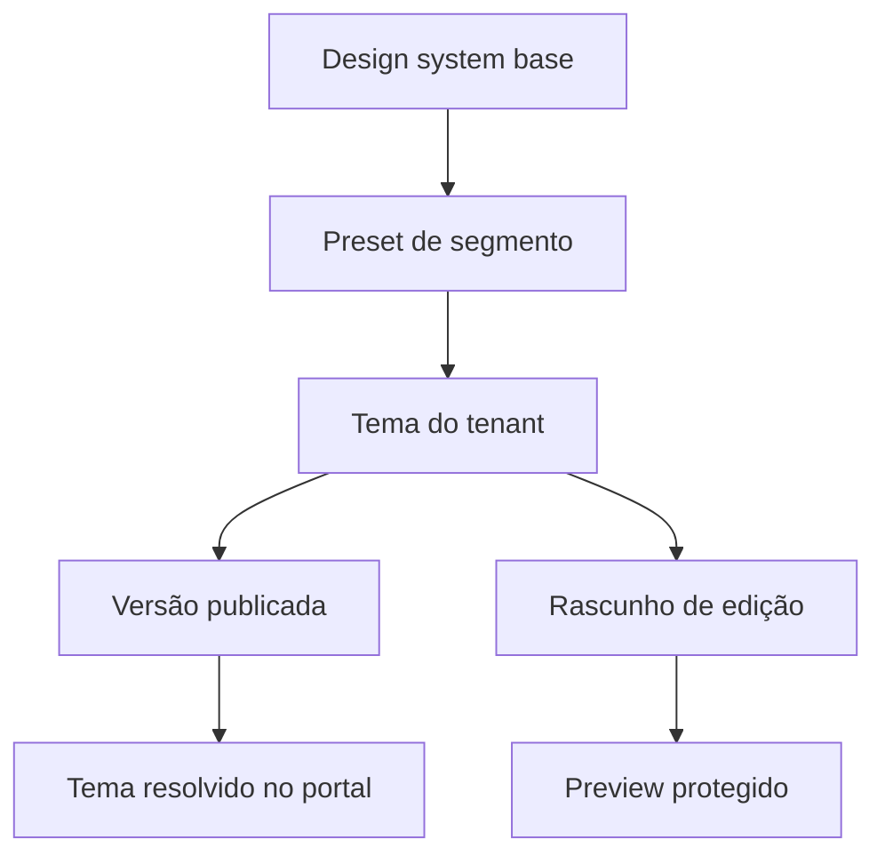

# Central de identidade visual

## Objetivo

Permitir que pessoas não técnicas criem experiências de marca convincentes, consistentes e acessíveis, sem transformar cada cliente em um fork do portal.

## Modelo mental

A identidade é composta por:

1. marca;
2. tokens semânticos;
3. variantes de componentes;
4. navegação e módulos;
5. versão publicada.

Conteúdo não faz parte do tema. Destaques não fazem parte do tema. Eles se combinam no preview.

## Camadas



Prioridade:

`base < preset < tenant version`.

Evitar override por página no MVP. Se necessário futuramente, usar configuração estruturada e auditada.

## Tokens semânticos

Não expor nomes como `blue500`. Expor intenção:

### Cores

- `color.brand.primary`;
- `color.brand.secondary`;
- `color.accent`;
- `color.surface.page`;
- `color.surface.card`;
- `color.surface.inverse`;
- `color.text.primary`;
- `color.text.muted`;
- `color.text.onBrand`;
- `color.border.subtle`;
- `color.link`;
- `color.status.info|success|warning|danger`;
- `color.sponsored`.

### Tipografia

- `font.heading`;
- `font.body`;
- `font.mono`;
- `font.scale`;
- `font.weight.heading`;
- `font.weight.body`;
- `lineHeight.compact|normal|relaxed`;

### Forma e espaço

- `radius.none|sm|md|lg`;
- `shadow.card`;
- `spacing.density`;
- `container.maxWidth`;
- `border.width`.

### Movimento

- `motion.duration.fast|normal`;
- `motion.easing`;

Respeitar `prefers-reduced-motion`.

## Exemplo de contrato

```json
{
  "schemaVersion": 1,
  "brand": {
    "name": "Instituição Demo",
    "logoLightAssetId": "asset_123",
    "logoDarkAssetId": "asset_124",
    "faviconAssetId": "asset_125",
    "coBranding": "powered_by_broadcast"
  },
  "tokens": {
    "color": {
      "brand": { "primary": "#173B57", "secondary": "#38A3A5" },
      "accent": "#D7A23A",
      "surface": { "page": "#FFFFFF", "card": "#F4F7F8", "inverse": "#102633" },
      "text": { "primary": "#10212B", "muted": "#54656F", "onBrand": "#FFFFFF" },
      "border": { "subtle": "#D9E1E5" },
      "link": "#0B6570"
    },
    "font": {
      "heading": "approved:source-sans",
      "body": "approved:source-sans",
      "scale": "editorial-md"
    },
    "radius": { "card": "12px", "button": "8px" },
    "spacing": { "density": "comfortable" }
  },
  "components": {
    "header": "masthead-clean",
    "hero": "split-editorial",
    "card": "image-top",
    "footer": "institutional-compact"
  },
  "layout": {
    "home": "editorial-portal-v1",
    "article": "reading-column-v1"
  }
}
```

O JSON é validado por schema no servidor. Valores desconhecidos não chegam ao runtime.

## O que pode ser configurado no MVP

### Marca

- nome de exibição;
- logo claro/escuro;
- ícone;
- favicon;
- co-branding Broadcast;
- texto institucional curto.

### Paleta

- cores semânticas;
- presets;
- geração de tons derivados;
- contraste e preview de estados.

### Tipografia

- fontes da biblioteca aprovada;
- upload de fonte apenas por administrador e com licença registrada;
- escala predefinida;
- pesos disponíveis.

### Componentes

- 2 a 3 variantes por componente principal;
- cabeçalho;
- hero;
- card;
- lista de manchetes;
- bloco de editoria;
- CTA/newsletter;
- rodapé;
- label de patrocinado.

### Layout

- presets completos, não canvas livre;
- ordem de módulos permitidos;
- mostrar/ocultar módulos opcionais;
- densidade;
- largura de conteúdo;
- posição do co-branding.

### Conteúdo institucional

- navegação;
- links sociais;
- rodapé;
- contato;
- política/termos;
- CTA principal.

## O que não pode ser configurado

- CSS livre;
- JavaScript;
- HTML;
- remoção de labels legais/editoriais obrigatórios;
- fonte sem licença;
- cor que torne texto essencial ilegível;
- alteração do conteúdo canônico pelo editor de tema;
- tracking arbitrário;
- componentes externos não aprovados.

## Fluxo da central

1. Criar tema a partir de preset ou duplicar.
2. Informar marca e assets.
3. Ajustar tokens.
4. Escolher variantes e módulos.
5. Configurar navegação e rodapé.
6. Selecionar dados de demonstração.
7. Revisar desktop e mobile.
8. Executar validações.
9. Salvar como rascunho.
10. Publicar versão.
11. Reverter se necessário.

## Preview

Painel recomendado:

- árvore curta de páginas: home, editoria, matéria, busca;
- seletor de conteúdo;
- viewport 390 px, 768 px e 1440 px;
- comparação claro/escuro apenas se ambos existirem;
- estado com branded content;
- estado de erro/sem imagem;
- lista de alertas;
- link “abrir preview isolado”.

O preview deve usar os mesmos componentes e resolução de tema do portal real. Não manter uma implementação paralela.

## Versionamento

- rascunho é mutável;
- publicação cria snapshot imutável;
- tenant referencia uma versão publicada;
- rollback troca a referência para uma versão anterior;
- assets antigos não são removidos enquanto referenciados;
- histórico mostra autor, data e resumo.

## Validações antes de publicar

- logo presente;
- contraste de texto;
- foco visível;
- favicon válido;
- fontes carregáveis/licenciadas;
- links obrigatórios;
- assets sem erro;
- componentes compatíveis com schema;
- tema renderiza páginas críticas;
- nenhuma cor/token desconhecido;
- co-branding conforme contrato.

## Presets iniciais

No MVP-0, os presets se materializam nas marcas fictícias Banco Demo Horizonte, Seguros Demo Atlas e Healthtech Demo Lúmen.

### Banco/gestora

Tom: sóbrio, analítico, dados e patrimônio.

Home: hero editorial, últimas notícias, previdência/seguros, indicadores futuros.

### Seguradora/previdência

Tom: confiança, proteção e planejamento.

Home: longevidade, prevenção, patrimônio, explicadores.

### Healthtech/farma

Tom: inovação, ciência e clareza.

Home: inovação médica, estudos, regulação, biotecnologia.

Presets não devem imitar marcas reais sem autorização. Usar identidades fictícias no seed.

## Acessibilidade

- contraste calculado em combinações reais;
- erros explicam qual token corrigir;
- zoom de 200%;
- navegação por teclado;
- foco não depende de uma cor configurável insegura;
- tokens de status têm fallback do design system;
- texto alternativo pertence ao asset/conteúdo, não ao tema.

## Performance

- converter tokens publicados em CSS variables cacheáveis;
- fontes com subset e `font-display`;
- limitar quantidade/peso de fontes;
- servir logos otimizados;
- não carregar configurações completas no cliente quando CSS resolvido basta;
- chave de cache inclui versão do tema.

## Pitch mode

Recursos específicos:

- duplicar tenant demo;
- presets com conteúdo pronto;
- upload rápido de logo;
- extrair paleta como sugestão, nunca publicar automaticamente;
- link expira;
- senha opcional;
- watermark discreto configurável;
- analytics de abertura sem identificar indevidamente o visitante;
- botão de revogação imediata;
- conversão de demo em trial preservando tema.
