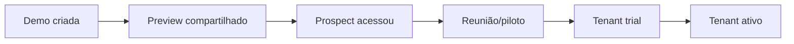

# Métricas e analytics

O MVP-0 implementa apenas eventos/logs mínimos necessários para diagnosticar CRUD, troca de tenant e abertura de preview. Painéis comerciais e analytics avançado entram após validação.

## Objetivo

Medir se o produto reduz esforço operacional, melhora a demonstração comercial e cria um canal de distribuição confiável. Pageviews isoladas não validam a tese.

## North star do MVP

`Tenants ativados que recebem conteúdo publicado com sucesso em pelo menos um canal por semana.`

Para a fase de pitch, usar:

`Demos qualificadas compartilhadas e acessadas pelo prospect.`

## KPIs por dimensão

### Editorial

- matérias publicadas por semana;
- tempo de rascunho até publicação;
- tempo em revisão;
- percentual agendado no horário;
- taxa de devolução;
- correções materiais;
- falhas de publicação;
- conteúdos sem fonte/alt/direito pendente;
- reaproveitamento: média de tenants/canais por matéria.

### White-label

- tempo para criar demo;
- temas publicados;
- falhas de validação;
- rollbacks;
- percentual de demos concluídas sem suporte técnico;
- páginas verificadas em mobile/desktop.

### Comercial

- demos criadas;
- previews compartilhados;
- previews acessados;
- tempo entre criação e primeiro acesso;
- prospects que avançam para piloto;
- demos convertidas em trial/active.

### Distribuição/API

- tenants consumindo;
- itens entregues;
- requisições e erro por classe;
- p95 de latência;
- uso de consulta incremental;
- credenciais inativas;
- correções/retiradas processadas;
- volume por contrato, sem billing no MVP.

### Público

- usuários/sessões conforme política;
- leitura de matéria;
- profundidade;
- busca e zero results;
- navegação por editoria;
- Core Web Vitals;
- erros;
- compartilhamento.

## Eventos recomendados

### CMS

- `content_draft_created`;
- `content_submitted_for_review`;
- `content_returned`;
- `content_approved`;
- `content_scheduled`;
- `content_published`;
- `content_publish_failed`;
- `content_paused`;
- `content_resumed`;
- `content_correction_published`;
- `distribution_changed`;
- `placement_published`.

### Tema/demo

- `demo_tenant_created`;
- `theme_preset_selected`;
- `theme_validation_failed`;
- `theme_version_published`;
- `theme_rolled_back`;
- `preview_link_created`;
- `preview_link_revoked`;
- `preview_opened`;
- `demo_converted`.

### API

- métricas agregadas por endpoint/status;
- `api_credential_created`;
- `api_credential_rotated`;
- `api_credential_revoked`;
- `sync_cursor_used`;
- `api_rate_limited`.

### Portal

- `article_viewed`;
- `search_submitted`;
- `search_zero_results`;
- `category_viewed`;
- `share_clicked`;
- `cta_clicked`.

## Propriedades padrão

- `event_id`;
- `occurred_at`;
- `environment`;
- `tenant_id`;
- `actor_role` quando interno;
- `content_id` quando aplicável;
- `theme_version_id` quando aplicável;
- `request_id`;
- `channel`;
- `device_class` no público.

Não enviar:

- token;
- chave;
- e-mail em evento genérico;
- corpo da matéria;
- consulta sensível;
- URL de preview completa;
- IP cru sem necessidade/base.

## Funil comercial

O CRM continuará sendo a fonte do estágio comercial; o produto fornece sinais, não substitui o CRM.

## Painéis do MVP

### Operação

- agenda e falhas;
- fila de revisão;
- publicações/pausas;
- saúde de jobs.

### Comercial

- demos e validade;
- acesso agregado;
- conversão para trial;
- tempo de montagem.

### API

- volume;
- erros;
- latência;
- última utilização por credencial;
- rate limit.

## Metas iniciais

Definir baseline nas primeiras semanas. Metas propostas:

- mediana de criação de demo < 15 min;
- publicação agendada dentro de 60 s;
- propagação de pausa < 60 s;
- erro 5xx da API < 1%;
- pelo menos 80% dos consumidores usando cursor incremental após onboarding;
- zero eventos confirmados de isolamento;
- 100% das correções materiais com nota e audit event.

## Qualidade dos dados

- eventos com schema versionado;
- idempotência por `event_id`;
- timezone em UTC, exibição local;
- ambiente separado;
- bots filtrados quando possível;
- documentação de definição;
- revisão mensal de eventos órfãos;
- não usar analytics de preview como prova definitiva de interesse sem contexto comercial.
